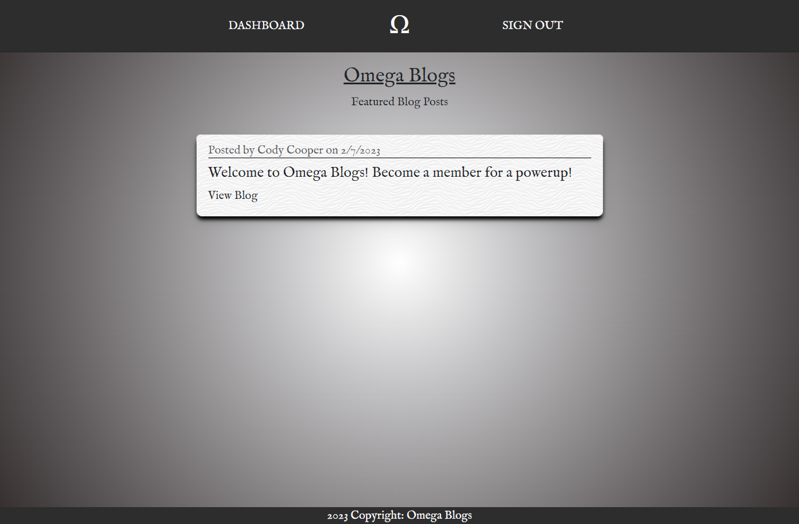
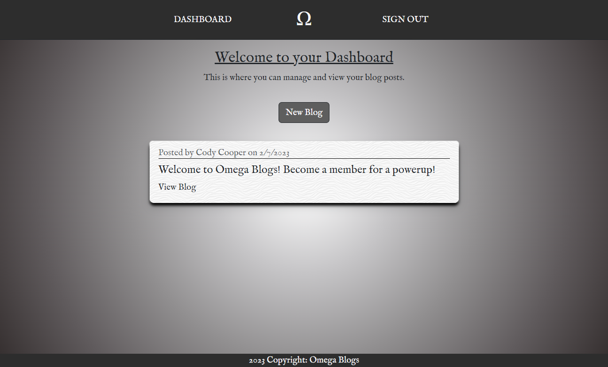
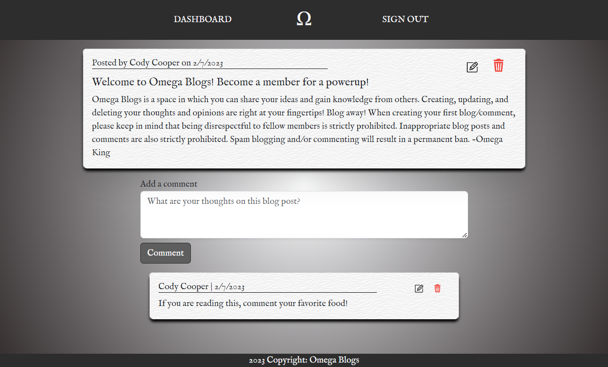
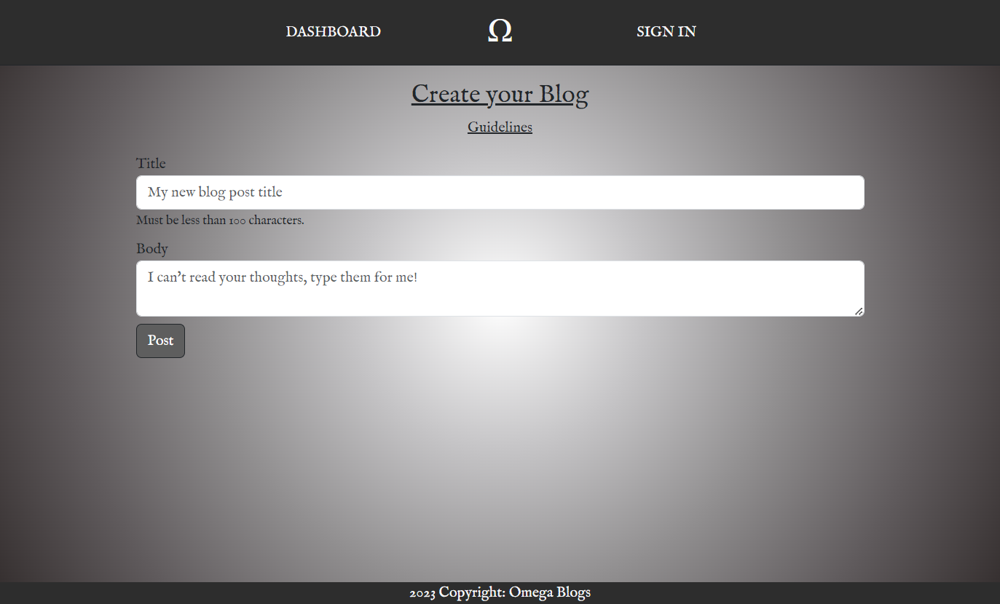

# Omega Blogs

## *Table of Contents*
 ___
  - [Installation](#description)
  - [Features](#features)
  - [Usage](#usage)
  - [Software](#software)
  - [Resources](#resources)
  - [License](#license)
  - [Questions](#questions)
  - [Screenshots](#screenshots)

## *Description*
___
Omega Blogs is a space in which you can share your ideas and gain knowledge from others. Created using MVP (Mode-View-Controller) paradigm and OOP (Object-Oriented-Programming), Omega Blogs has a simple yet powerful design that has true potential.
Deployed Application: https://omega-blogs.herokuapp.com/ 

##  *Features*
___
### In order to access the main features of Omega Blogs you must be logged in.
- Current Features
    - Creating and viewing blogs.
    - Adding comments to blogs.
    - Editing/Deleting comments or blogs.
    - Account creation
- Future Updates
    - Like/Dislike buttons
    - Admin access
    - Categories
    - Share Button

## *Usage*
___
### In order to have full access to Omega Blogs the user must be a member
- Becoming a Member
  - Click on the SIGNIN navbar link on the top right
  - If already a member, sign in with credentials
  - If not a member, click the become a member link and fill out the forms
- Posting your first blog
    - Navigate to the DASHBOARD nav link on the top left
    - Once in your dashboard, click new Blog.
    - Fill out the forms for title and body, then submit.
- Commenting on a blog
    - View the blog of your choice and fill out the comment form.
    - Once finished, click submit.
- Editing/Deleting
    - To delete/edit a blog or comment click on either the trashcan to delete or paper symbol to edit.
    - Once finished, click the submit button to update your blog/comment.

## *Software*
___
Omega Blogs was built/deployed using the following:
- VSCode
- Gitbash/Github
- Heroku
- MySQL
- Node JS
  - NPM
  - Sequelize(Object Relational Mapping)
  - Handlebars
  - Express
    - express-session
    - express-handlebars
    - express-session-sequelize
    - connect-session-sequelize
  - mysql2
  - bcrypt
  - dotenv
- HTML
- CSS
  - Bootstrap
- Javascript
- MVC paradigm (Model-View-Controller)
- OOP (Object Oriented Programming)

## *Resources*
___
- Google Images | https://images.google.com/
- Toptal | https://www.toptal.com/designers/subtlepatterns/

## *License*
___
This application is covered under the MIT license.
For more information about this license please visit https://opensource.org/licenses/MIT

## *Questions*
___
For comments/conerns please contact me at https://github.com/Ccooper9893
Github Repo: https://github.com/Ccooper9893/Omega-Blogs

## *Screenshots*
___
Homepage

Dashboard

Blog Post

Blog Create

